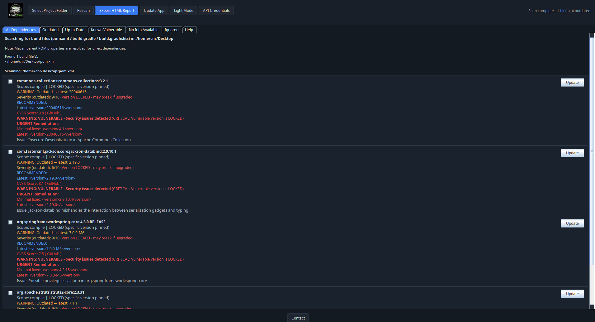
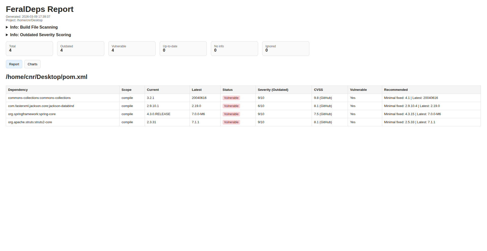
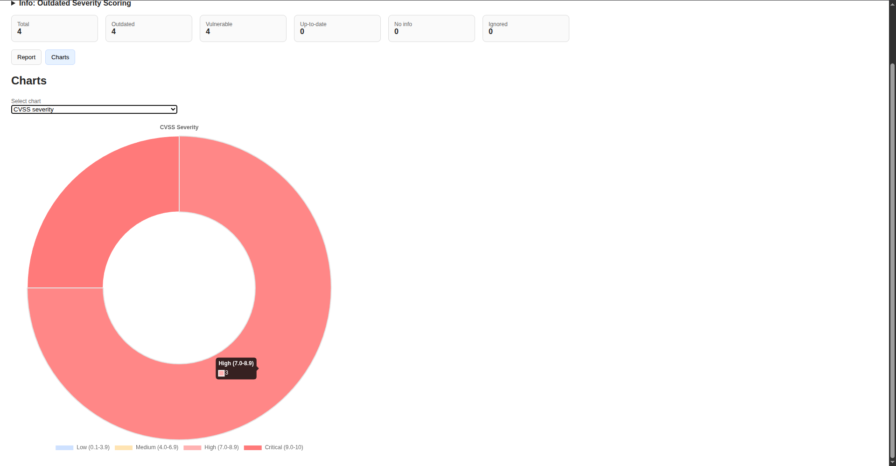
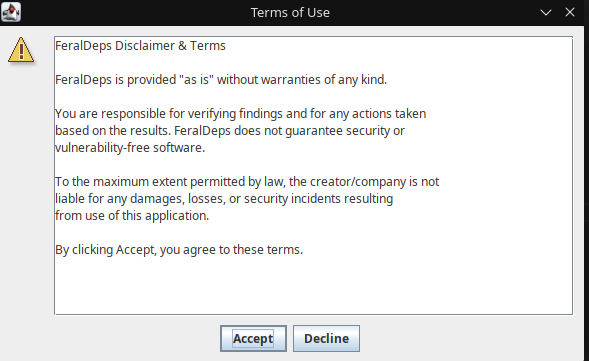

# ⭐ If you find this tool useful, consider starring the repo - it helps the project grow!


# feraldeps-core

Open‑source, local dependency and vulnerability scanner for Java and JavaScript projects.
Maintained by [@Conor-20105865](https://github.com/Conor-20105865).

The primary deliverable is a desktop GUI; most of the work (parsing your project
files and generating reports) runs locally. However, to check for newer versions,
vulnerabilities and CVSS severity scores the tool does make outbound HTTP
requests to public APIs such as Maven Central, npm registry, the OSV (vulnerability) service and
various CVSS providers (OSS Index, NVD, GitHub, etc.).

## Download

Download the latest prebuilt jar (no build required):

- [feraldeps-0.1.2.jar](https://github.com/PardixLabs/feraldeps-core/releases/download/v0.1.2/feraldeps-0.1.2.jar)

Run by either double-clicking the jar (on supported OSes) or via command line:

```bash
java -jar /path/to/feraldeps-0.1.2.jar
```

If you have a different version, update the filename accordingly (e.g., `feraldeps-0.1.1.jar`).


## Features

- Scans Java (Maven/Gradle) and JavaScript (npm) projects for declared dependencies
- Detects outdated versions and known vulnerabilities
- Cross-ecosystem CVSS severity scoring from multiple sources
- Generates an HTML/CSV report with JavaScript dependency support
- Simple GUI with manual update checks and API credential management

## Roadmap

* Add transitive-dependency analysis (currently only first-level dependencies are scanned)
* Extend npm support to include package-lock.json and yarn.lock for transitive dependencies
* Support additional ecosystems such as Python
* Improve offline/cached operation and CI integration

## Prerequisites

- Java (JDK) 11 or newer
- Maven 3.6+ (to build from source)

## Building and running

```bash
# ensure you are in the repository root
cd /path/to/feraldeps-core

# compile and package
mvn clean package

# after a successful build the runnable jar is located at:
# target/feraldeps-<version>.jar
java -jar target/feraldeps-*.jar
```

## Quick start

1. Run the application:
   ```bash
   java -jar target/feraldeps-*.jar
   ```
2. In the GUI, select a project folder (Java with pom.xml/build.gradle or JavaScript with package.json) and click **Scan**.
3. Review the generated report; export HTML if desired.

## Configuration

The GUI includes an **API Credentials** button where you can configure optional API credentials
for enhanced CVSS severity scoring:

- **OSS Index credentials** – optional, used for access to Sonatype's OSS Index CVSS service.
  Provide your username and token for enhanced vulnerability data.
- **GitHub token** – optional, used to query GitHub's vulnerability database for CVSS
  scores. Provide a personal access token with appropriate permissions.

These credentials are stored locally on your device and are **never transmitted** except when making
authenticated requests to the respective services. The credentials dialog includes convenient
**Paste** buttons for easy credential entry. Without these credentials, the tool will fall back to
public APIs (OSV, NVD, etc.) for CVSS data. This may cause blank data to be return within the report.

## Privacy Policy

This application scans your local project files to check for dependency updates
and security vulnerabilities. During normal operation, the following external
APIs are contacted:

- **Maven Central** (`search.maven.org`) — to check for latest Java dependency versions
- **npm Registry** (`registry.npmjs.org`) — to check for latest JavaScript package versions
- **OSV (Open Source Vulnerabilities)** (`api.osv.dev`) — to check for known
  vulnerabilities in your dependencies (supports both ecosystem-aware queries)
- **CVSS providers:**
  - **OSS Index** (`ossindex.sonatype.org`) — optional, requires credentials
  - **NVD (National Vulnerability Database)** (`services.nvd.nist.gov`) — to
    retrieve severity scores
  - **GitHub** (`api.github.com`) — optional, requires authentication token

No user data, project metadata, or dependency information is logged, stored, or
shared with any third party. Your project's dependency list and scan results
remain on your local machine. External API calls are rate-limited and cached to
minimize network traffic.

### Disabling external lookups

There is no built‑in offline mode at present. You can modify the source to
short‑circuit network calls (e.g. return empty results) if you need to run in
an air‑gapped environment; let us know if you'd like help implementing this
feature.

## Ignored files
See `.gitignore` for details; build artifacts live under `target/` and are
excluded from version control.

## Screenshots

Below are a few screenshots showing the main UI and generated report output.


*Main application window.*


*Generated report summary view.*


*Vulnerability severity score visualization.*


*First launch / terms of use dialog.*

## Code Signing Policy

Future releases of feraldeps-core may be code-signed. The team structure is as follows:

- **Committers and reviewers:** [PardixLabs team](https://github.com/orgs/PardixLabs)
- **Release approvers:** [@Conor-20105865](https://github.com/Conor-20105865) and core maintainers

Each release must be reviewed and manually approved before signing. Signed
releases include a valid signature confirming that the binary is built from
the exact source code at the tagged release commit.

## Contributing
Please read [CONTRIBUTING.md](CONTRIBUTING.md) before submitting
issues or pull requests.

## Code of Conduct
All contributors are expected to abide by the
[Code of Conduct](CODE_OF_CONDUCT.md).
